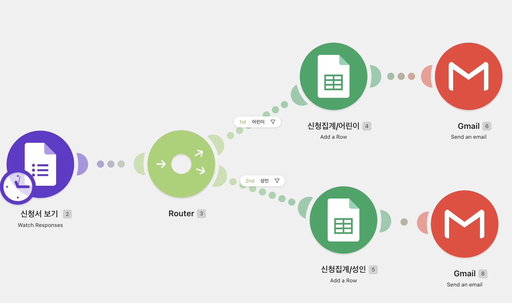
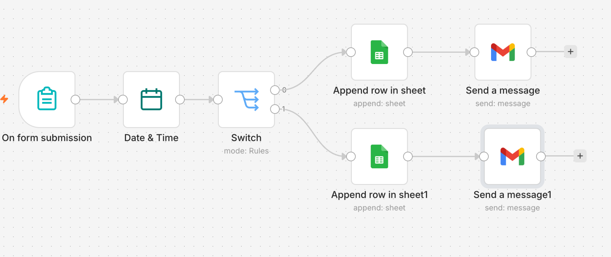
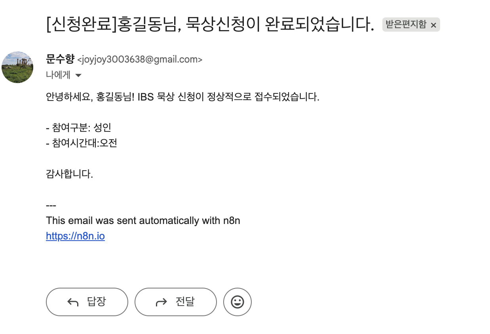
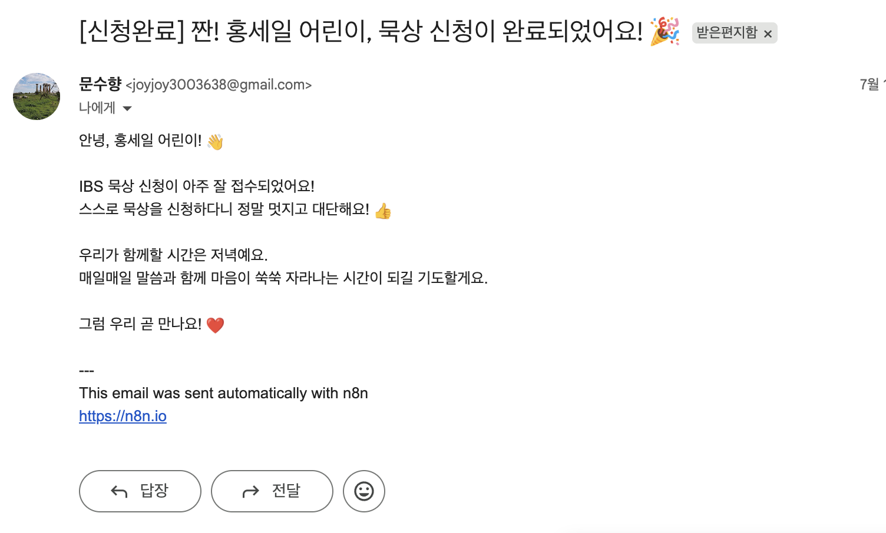

# 프로젝트 1: 자동화 도구 비교 구현

## 1. 프로젝트 주제

**Make와 n8n을 활용한 Q&A IBS 묵상 신청서 자동화 비교 구현**

Q&A IBS 묵상 신청서가 제출되면 신청자의 정보를 자동으로 분류하고 기록한 뒤, 안내 이메일을 발송하는 업무를 구현하였다. 같은 업무를 두 가지 노코드 자동화 도구인 Make와 n8n으로 각각 제작하여 작업 방식과 장단점을 비교하였다.

---

## 2. 자동화 목표

1. 새로 제출된 신청서 정보를 자동으로 가져온다.
2. 참여 대상을 어린이와 성인으로 구분한다.
3. 신청자 정보를 각각의 Google 스프레드시트에 기록한다.
4. 신청자에게 접수 및 참여 안내 이메일을 자동으로 발송한다.
5. Make와 n8n의 구현 과정, 편의성 및 활용도를 비교한다.

## 3. 전체 자동화 흐름

> Q&A IBS 묵상 신청서 제출 → 신청 정보 확인 → 어린이·성인 분류 → 해당 시트에 기록 → 맞춤 안내 이메일 발송

---

## 4. Make를 활용한 자동화

*그림 1. Make를 활용한 Q&A IBS 묵상 신청서 자동화 흐름*

Make에서는 신청서 응답을 감지한 후 Router를 이용하여 참여 대상자를 어린이와 성인으로 구분하였다. 분류된 신청자 정보는 각각의 Google 스프레드시트에 새로운 행으로 기록되며, 마지막 단계에서 Gmail을 통해 신청자에게 안내 이메일이 자동으로 발송되도록 구현하였다.

> 신청서 응답 확인 → Router로 어린이·성인 분류 → 해당 시트에 행 추가 → Gmail 안내 메일 발송

---

## 5. n8n을 활용한 자동화

*그림 2. n8n을 활용한 Q&A IBS 묵상 신청서 자동화 흐름*

n8n에서는 신청서가 제출되면 자동화가 시작되고, Date & Time 노드에서 접수 시간을 생성하도록 구성하였다. 이후 Switch 노드가 참여 대상자를 구분하고, 각 대상자에 맞는 Google 스프레드시트에 정보를 추가한 뒤 Gmail로 안내 메시지를 발송하도록 구현하였다.

> 신청서 제출 → 날짜와 시간 생성 → Switch로 참여 대상 분류 → 해당 시트에 행 추가 → Gmail 안내 메일 발송

---

## 6. 자동화 실행 결과

### 6.1 성인 신청자 이메일

*그림 3. 성인 참여자에게 자동 발송된 Q&A IBS 묵상 신청 완료 이메일*

성인 신청자가 신청서를 제출하면 신청자의 이름, 참여 구분 및 참여 시간대가 포함된 접수 완료 이메일이 자동으로 발송된다. 이를 통해 신청자는 자신이 입력한 정보가 정상적으로 접수되었는지 확인할 수 있다.

### 6.2 어린이 신청자 이메일

*그림 4. 어린이 참여자에게 자동 발송된 Q&A IBS 묵상 신청 완료 이메일*

어린이 신청자에게는 성인용 이메일보다 친근한 표현과 이모지를 사용한 안내 이메일이 발송된다. 신청자의 이름과 참여 시간대가 자동으로 본문에 반영되어 개인별 안내 메시지가 생성된다.

성인과 어린이 두 분기에서 이메일이 정상적으로 발송됨으로써 다음 자동화가 완성되었음을 확인하였다.

> 신청서 제출 → 성인·어린이 분류 → 해당 스프레드시트에 명단 기록 → 대상별 맞춤 이메일 발송

---

## 7. Make와 n8n의 특징 및 장단점 비교

| 비교 항목 | Make | n8n |
|---|---|---|
| 작업 방식 | 모듈을 연결하고 각 항목의 파라미터를 직접 설정 | 노드를 연결하여 데이터의 흐름을 구성 |
| 화면 특징 | 모듈과 Router의 분기 구조가 시각적으로 명확함 | 노드가 왼쪽에서 오른쪽으로 연결되어 실행 순서를 파악하기 쉬움 |
| 참여 대상 분류 | Router와 Filter를 이용해 어린이·성인으로 분류 | Switch 노드의 규칙을 이용해 어린이·성인으로 분류 |
| 데이터 입력 | 각 필드를 Google Sheets 열에 직접 매핑 | 표현식과 입력값을 이용해 Google Sheets에 매핑 |
| 이메일 발송 | 분기마다 Gmail 모듈을 연결해 이메일 발송 | 분기마다 Gmail 노드를 연결해 메시지 발송 |
| 주요 장점 | 화면이 직관적이며 초보자도 모듈의 역할과 분기 과정을 이해하기 쉬움 | 노드별 입출력 데이터와 실행 과정을 자세히 확인할 수 있고 확장성이 높음 |
| 추가 장점 | 데이터 필드를 하나씩 매핑하면서 자동화의 기본 원리를 익히기 좋음 | Date & Time, Switch 등 다양한 노드를 이용해 세밀하게 처리할 수 있음 |
| 주요 단점 | 모듈마다 파라미터를 설정하고 필드를 반복해서 매핑해야 함 | 표현식, 조건 규칙, 노드 설정에 익숙해지는 데 시간이 필요함 |
| 오류 확인 | 경고가 표시되지만 정확한 원인을 찾기 어려울 때가 있음 | 노드별 결과를 확인할 수 있지만 오류 메시지가 기술적으로 느껴질 수 있음 |
| 제작 중 어려움 | Router 연결, Filter 조건, 시트 선택 및 필드 매핑을 반복 수정함 | AI 자동 생성 오류로 필요한 노드를 직접 구성하고 조건을 설정함 |
| 적합한 사용자 | 처음 자동화를 배우거나 간단한 업무를 빠르게 구현하려는 사용자 | 복잡한 데이터 처리와 세밀한 제어가 필요한 사용자 |

---

## 8. 비교 및 종합평가

두 도구로 동일한 자동화 업무를 구현한 결과, 본 프로젝트에서는 **Make가 더 적합한 도구**라고 평가하였다.

Make는 모듈과 Router가 시각적으로 명확하게 표시되어 신청서 정보가 어린이와 성인으로 분류되는 과정을 쉽게 이해할 수 있었다. 각 모듈의 파라미터와 데이터 필드를 직접 설정하는 과정은 다소 시간이 필요했지만, 자동화가 어떤 순서와 조건으로 실행되는지 배우는 데 도움이 되었다.

n8n은 노드별 데이터와 실행 결과를 자세히 확인할 수 있고 확장성이 높다는 장점이 있었다. 그러나 AI 자동 생성 기능에서 오류가 발생했고, Switch 조건과 표현식을 직접 설정하는 과정이 Make보다 어렵게 느껴졌다.

따라서 초보자가 자동화의 구조를 배우고 비교적 간단한 업무를 구현하는 이번 프로젝트의 목적에는 **Make가 더 직관적이고 사용하기 편리한 도구**라고 판단하였다. 다만 앞으로 복잡한 데이터 처리와 세밀한 제어가 필요한 자동화를 제작할 때는 n8n을 활용할 수 있을 것으로 생각한다.

---

## 9. 배운 점

이번 프로젝트를 통해 신청서 접수부터 참여 대상 분류, 스프레드시트 기록, 이메일 발송까지 하나의 흐름으로 자동화할 수 있다는 것을 배웠다.

Make에서는 각 모듈의 파라미터와 데이터 필드를 직접 설정하면서 자동화의 기본 원리를 이해할 수 있었다. 또한 Router와 Filter가 데이터의 조건을 확인하여 서로 다른 경로로 전달한다는 점을 배웠다.

n8n에서는 각 노드의 입력값과 출력값을 확인하면서 데이터가 이동하고 처리되는 과정을 이해하였다. 오류가 발생했을 때는 전체 플로우를 한꺼번에 수정하기보다 각 노드를 하나씩 실행하여 입력값, 조건식 및 출력값을 확인하는 것이 중요하다는 점을 배웠다.