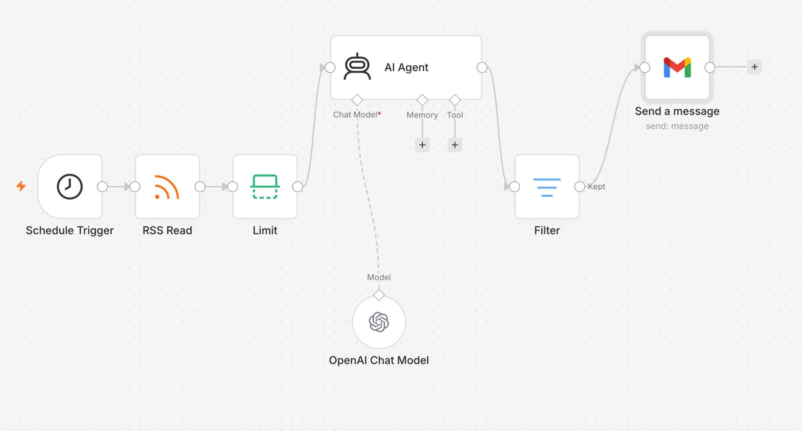
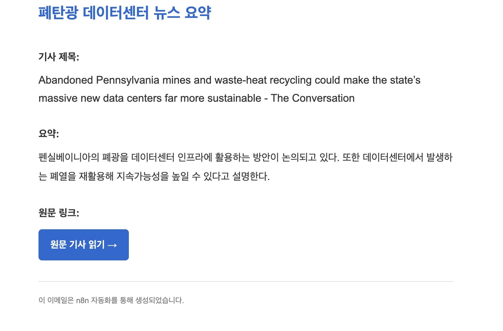

# 2. 프로젝트 2: AI 뉴스 요약 자동화

### 2.1 프로젝트 주제

**n8n과 AI를 활용한 폐탄광 데이터센터 관련 뉴스 수집·요약·이메일 발송 자동화**

폐탄광을 데이터센터로 재활용하는 사례와 관련된 최신 뉴스를 자동으로 수집하고, AI가 기사의 관련성을 판단하여 한국어로 요약한 뒤 이메일로 발송하는 자동화 시스템을 구현하였다. 여러 뉴스 사이트를 직접 검색하고 내용을 정리해야 하는 반복 업무를 줄이는 것이 목적이다.

### 2.2 자동화 목표

1. Google News RSS에서 관련 기사를 자동으로 가져온다.
2. 처리할 기사 수를 3개로 제한한다.
3. AI가 기사의 주제 관련성을 판단한다.
4. 해외 기사를 한국어로 번역하고 핵심 내용을 2~3줄로 요약한다.
5. 관련 없는 기사는 Filter에서 제외한다.
6. 기사 제목, 요약 및 원문 링크를 Gmail로 발송한다.
7. 지정한 시간에 자동으로 실행되도록 구성한다.

### 2.3 전체 자동화 흐름

> Schedule Trigger → RSS Read → Limit → AI Agent + OpenAI Chat Model → Filter → Gmail

*그림 5. n8n을 활용한 폐탄광 데이터센터 관련 뉴스 수집·요약·이메일 발송 자동화*

### 2.4 주요 노드의 역할

| 노드 | 주요 역할 |
|---|---|
| Schedule Trigger | 설정된 시간에 자동화를 시작 |
| RSS Read | Google News RSS에서 새로운 뉴스 기사를 수집 |
| Limit | 처리할 기사 수를 3개로 제한 |
| AI Agent | 기사 관련성 판단, 한국어 번역 및 핵심 내용 요약 |
| OpenAI Chat Model | AI Agent가 기사를 이해하고 처리할 수 있도록 언어 모델 제공 |
| Filter | AI 결과 중 관련 없는 기사를 제외하고 관련 기사만 유지 |
| Gmail | 선별된 기사의 제목, 요약 및 원문 링크를 이메일로 발송 |

### 2.5 AI Agent 처리 기준

- 폐탄광을 데이터센터로 활용하는 내용과 관련 있는지 판단한다.
- 관련 기사라면 핵심 내용을 한국어로 2~3줄 요약한다.
- 해외 기사는 자연스러운 한국어로 번역한다.
- 원문을 확인할 수 있도록 기사 링크를 포함한다.
- 관련 없는 기사는 `관련없음`으로 표시한다.

### 2.6 자동화 실행 과정

1. Schedule Trigger가 설정된 시간에 자동화를 시작한다.
2. RSS Read가 Google News RSS에서 새로운 기사를 가져온다.
3. Limit 노드가 처리할 기사 수를 3개로 제한한다.
4. AI Agent와 OpenAI Chat Model이 기사의 관련성을 판단하고 해외 기사를 한국어로 번역·요약한다.
5. Filter가 `관련없음`으로 판단된 기사를 제외한다.
6. Gmail이 선별된 기사의 제목, 요약 및 원문 링크를 이메일로 발송한다.

### 2.7 구현 결과

*그림 6. AI가 선별·요약한 폐탄광 데이터센터 뉴스의 이메일 자동 발송 결과*

AI Agent가 관련 기사에서 제목, 한국어 요약 및 원문 링크를 추출하였으며, Gmail 노드를 통해 뉴스레터 형태의 이메일을 자동으로 발송하였다. HTML 형식을 적용하여 기사 제목과 요약을 명확하게 구분하고, 긴 원문 주소는 `원문 기사 읽기` 버튼으로 변경하였다. 이를 통해 이메일의 가독성과 사용 편의성을 개선하였다.

최종적으로 폐탄광의 데이터센터 활용과 관련된 기사만 선별하여 한국어 요약 이메일로 자동 발송할 수 있었다. 여러 기사를 직접 검색하고 읽은 뒤 정리해야 했던 반복 업무를 줄일 수 있었다.

### 2.8 오류와 해결 과정

| 발생한 문제 | 원인 및 해결 방법 |
|---|---|
| OpenAI 노드 실행 오류 | OpenAI API 계정의 크레딧 부족을 확인하고 해결함 |
| `No output data` 표시 | AI Agent의 프롬프트와 입력 데이터 연결 상태를 수정함 |
| 관련 없는 기사도 다음 단계로 전달됨 | Filter 조건을 수정하여 `관련없음` 결과를 제외함 |
| Filter에서 AI 결과 선택이 어려움 | Value 1을 Expression으로 변경하고 AI Agent의 `output` 값을 연결함 |
| Gmail 제목과 본문이 잘못 입력됨 | Subject와 Message의 데이터 매핑 위치를 다시 설정함 |
| 이메일 줄바꿈과 가독성 문제 | Gmail의 Email Type을 HTML로 변경하고 줄 간격과 영역을 지정함 |
| 원문 링크가 너무 길게 표시됨 | 링크 주소를 `원문 기사 읽기` 버튼으로 변경함 |
| n8n 자동 생성 기능 오류 | 자동 생성을 반복하지 않고 필요한 노드를 직접 추가하고 연결함 |

### 2.9 배운 점

이 프로젝트를 통해 단순히 데이터를 이동시키는 자동화를 넘어, AI가 수집된 정보를 판단하고 번역하며 요약할 수 있다는 것을 배웠다. 또한 AI Agent, Chat Model, Filter가 서로 다른 역할을 수행한다는 점을 이해하였다.

특히 Filter의 조건을 정확히 설정해야 관련 있는 데이터만 다음 노드로 전달된다는 것을 확인하였다. 오류가 발생했을 때는 전체 자동화를 한꺼번에 수정하기보다 각 노드의 입력값과 출력값을 차례로 확인하는 것이 중요하다는 점도 배웠다.

### 2.10 종합평가

프로젝트 2에서는 n8n과 AI를 결합하여 뉴스 수집, 관련성 판단, 번역, 요약, 이메일 발송까지 하나의 흐름으로 자동화하였다. 이를 통해 반복적인 뉴스 검색과 정리 시간을 줄이고 필요한 정보만 빠르게 받아볼 수 있었다.

향후에는 여러 기사를 한 통의 뉴스레터로 묶고, 중복 기사를 제외하며, 발송 결과를 별도의 스프레드시트에 기록하는 기능을 추가할 수 있다.

---

